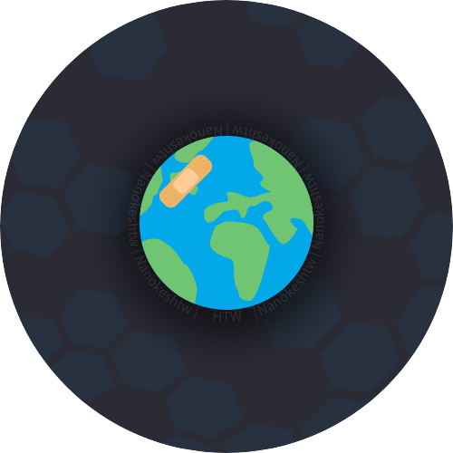
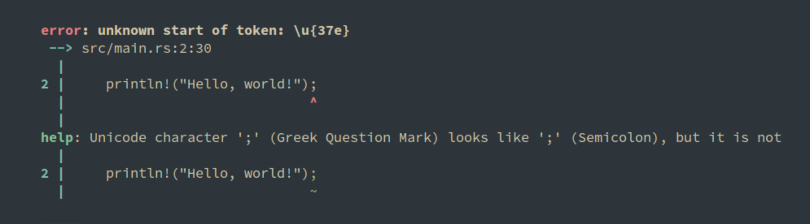

<div align="center">
  </img>
  
  # Hey There, I'm Gavin :wave:
</div>

I'm a software engineering student at the Rochester Institute of Technology and co-founder of Eventify Apps. <sup><sub>I am also a proud rustacean 🦀<sub></sup>



## About Me :metal:

```rust
fn main {
  let location: Location = "Rochester, NY 🇺🇸".into();
  let experience: u8 = parse_experience!("3+ years 👨‍💻");
  let contact: Contact = Contact::Email("nanokeshtw@gmail.com 📫");

  println!(
    "Location: {}\nExperience: {}\nContact: {}",
    location.into(),
    experience,
    contact.inner()
  );
}
```

I am a software engineering student and social entrepreneur who loves to learn and to live life! :sunflower:

- :seedling: Proficient in Rust, Typescript, Python, React, Svelte, and currently learning Elixir.
- :book: Studying Software Engineering at the Rochester Institute of Technology.
- :earth_americas: Passionate about leveraging technology for social impact and improving access to education.
- :art: In my free time, I enjoy coding, solving puzzles, and exploring the great outdoors.

## My Skills :briefcase:


## Reach Out

[](mailto:nanokeshtw@gmail.com)
[](https://www.linkedin.com/in/gavin-noktes)
[](https://stackoverflow.com/users/16148344/nanokeshtw)
